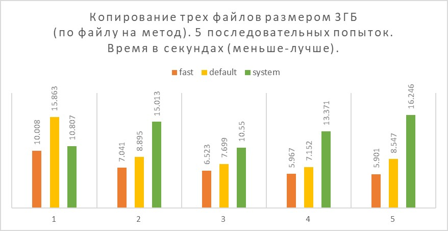

fast-windows-big-file-copy
---

Задача
---
Напишите функцию для копирования больших файлов (> 100 GB) которая будет 
работать значительно быстрее чем https://docs.python.org/2/library/shutil.html#shutil.copy на ОС Windows.

Код должен быть кроссплатформенный и работать на linux, os x, windows.

Ожидается что написанная функция будет принимать на вход путь копируемого файла и путь копии файла введенные пользователем в консоли.
Максимальная длина пути копируемого файла ограничена в 1024 символа, максимальная длина пути копии файла ограничена в 3096 символов.

О решении
-----


В данном решении рассмотрена проблема копирования больших файлов на windows. Решение windows-ориентированное и предлагает достижения поставленной задачи через изменения размера буфера при копировании. Данный способ широко распространен в качестве работающего решения.

В рамках собственного исследования, данный способ проверен на эффективность. При использовании SSD диска, использование буфера большего объёма (10MB против 16KB по умолчанию) при копировании увеличивает скорость в среднем на 15-75%. Более того, данный подход сравнивался с использованием стандартной windows функции copy, в большинстве случаев, по скорости, системный вызов оказывается самым медленным (тут, скорее всего, виновато то, что копируются не только данные но и атрибуты файлов).

Отдельным пунктом решается проблема копирования файлов с длинными путями (1000 и более символов). Используется подход предложенный здесь [https://stackoverflow.com/questions/36219317/pathname-too-long-to-open/36219497](https://stackoverflow.com/questions/36219317/pathname-too-long-to-open/36219497)

Решение кроссплатформенное, проверено на ubuntu 18.04 и windows 10, должно работать и на других операционных системах.

Сравнение эффективности
---

Проверяется: пять последовательных попыток копирования трех разных 3GB файлов на физическом диске, которые имеют одинаковое содержимое. Первый запуск проводился на только что запущенной системе, файлы только что созданы. Видна разница примерно в 50% между стандартным shutil.copyfileobj (желтый столбец - default) c маленьким буфером, и увеличенным значением буфера (оранжевый столбец - fast). В последующих запусках, судя по всему, происходит использование кэшей дисков и кэшей операционной системы, поэтому разница сглаживается. Хотя fast все также остается впереди.


 
Зависимости
---

* python >= 2.7


Копирование
---

Чтобы выполнить копирование файла из одного места в другое надо запустить

```
usage: copy_utils.py [-h] [{fast,default,system}] [src_path] [dest_path]

позиционные аргументы:
  {fast,default,system}
                        метод используемый для копирования, 
                        "fast" для копирования с буфером 10МБ
                        "default" для копирования с буфером 16КБ
                        "system" для копирования с использованием системной функции copy на windows, и эквивалент default для других платформ
  src_path              путь исходного файла, длина не более 1026 символов, если не указан, будет предложено ввести вручную
  dest_path             путь файла назначения, длина не более 3096 символов, если не указан, будет предложено ввести вручную
```

при копировании все необходимые папки будут созданы.

Тесты
---

Проверяют работу с длинными именами. Запускаются

```
python test.py
``` 
